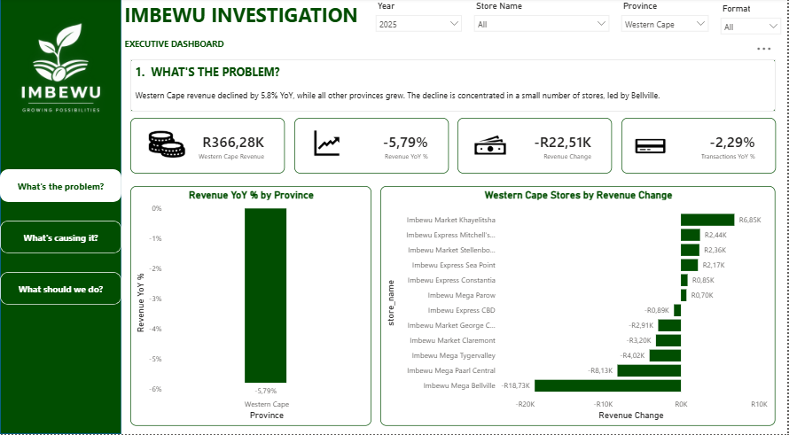
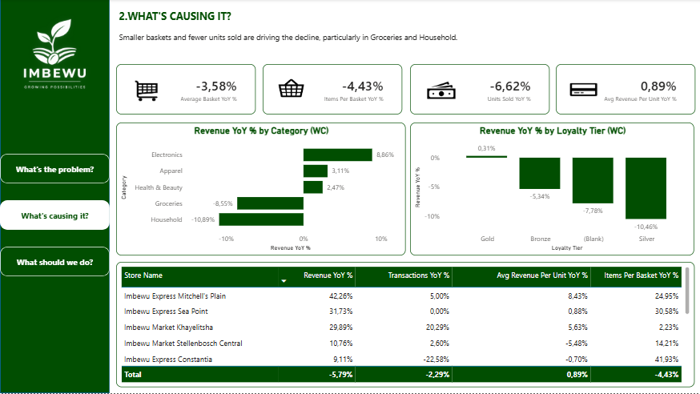
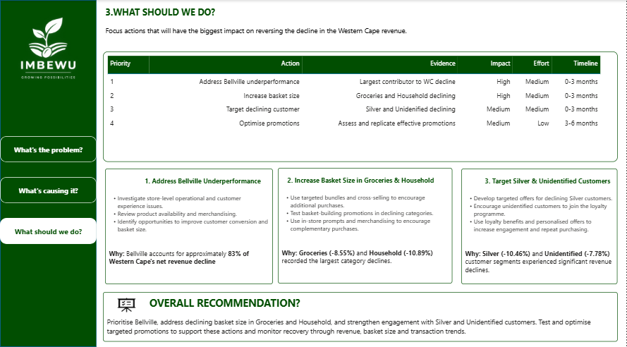

# Imbewu Retail Sales Investigation

## Executive Analytics Capstone Project

**Tools:** Power BI • SQL • DAX • Data Analysis • Data Visualisation

---

## 📌 Project Overview

This project investigates a retail revenue decline using transactional, product, customer, store and promotional data.

The analysis follows a structured business investigation:

1. **What's the problem?**
2. **What's causing it?**
3. **What should we do?**

The objective was to identify where the revenue decline occurred, investigate the factors contributing to the decline, and translate the findings into practical, data-driven recommendations.

---

## 🔎 Business Problem

The investigation identified a **5.79% year-on-year revenue decline in the Western Cape**, representing approximately **R22.5K in lost revenue**.

The decline is concentrated at store level, with **Imbewu Mega Bellville accounting for approximately 83% of the Western Cape's net revenue decline**.

The analysis therefore moved beyond identifying the overall decline to investigate customer purchasing behaviour, product categories and customer segments.

---

## 📊 Key Findings

### 1. Western Cape revenue declined

Western Cape revenue declined by **5.79%**, while transactions declined by **2.29%**.

The store-level analysis showed that the decline was concentrated in a relatively small number of stores, with **Imbewu Mega Bellville** being the largest negative contributor.

### 2. Customers are purchasing fewer units

Key purchasing indicators showed:

| Metric                   | YoY Change |
| ------------------------ | ---------: |
| Average Basket Value     | **-3.58%** |
| Items per Basket         | **-4.43%** |
| Units Sold               | **-6.62%** |
| Average Revenue per Unit | **+0.89%** |

These results indicate that lower purchase volume and smaller baskets are important contributors to the revenue decline.

### 3. Category performance is uneven

Within the Western Cape:

| Category        | Revenue YoY % |
| --------------- | ------------: |
| Electronics     |    **+8.86%** |
| Apparel         |    **+3.11%** |
| Health & Beauty |    **+2.47%** |
| Groceries       |    **-8.55%** |
| Household       |   **-10.89%** |

The decline is therefore concentrated in particular categories rather than occurring uniformly across the product portfolio.

### 4. Customer segments require attention

Silver customers recorded a **10.46% revenue decline**, while the Unidentified customer segment declined by **7.78%**.

These segments provide opportunities for targeted customer engagement and further investigation.

---

## 💡 Recommendations

Four priority actions were identified:

| Priority | Action                                        | Evidence                                  | Impact | Effort | Timeline   |
| -------- | --------------------------------------------- | ----------------------------------------- | ------ | ------ | ---------- |
| 1        | Address Bellville underperformance            | Largest contributor to WC decline         | High   | Medium | 0–3 months |
| 2        | Increase basket size in Groceries & Household | Both categories declining                 | High   | Medium | 0–3 months |
| 3        | Target Silver & Unidentified customers        | Significant segment declines              | Medium | Medium | 0–3 months |
| 4        | Optimise promotions                           | Assess and replicate effective promotions | Medium | Low    | 3–6 months |

### Recommended actions

**Address Bellville underperformance**

* Investigate store-level operational and customer experience issues.
* Review product availability and merchandising.
* Identify opportunities to improve customer conversion and basket size.

**Increase basket size in Groceries & Household**

* Use targeted bundles and cross-selling to encourage additional purchases.
* Test basket-building promotions in declining categories.
* Use in-store prompts and merchandising to encourage complementary purchases.

**Target Silver and Unidentified customers**

* Develop targeted offers for declining Silver customers.
* Encourage unidentified customers to join the loyalty programme.
* Use loyalty benefits and personalised offers to increase engagement and repeat purchasing.

**Optimise promotions**

* Identify promotions associated with stronger performance.
* Test targeted promotions within declining categories.
* Monitor revenue, transactions and basket-level KPIs to evaluate effectiveness.

---

## 📈 Power BI Dashboard

The Power BI dashboard was designed around three management questions:

### What's the problem?

Identifies where the revenue decline is occurring and highlights the stores contributing most to the decline.

### What's causing it?

Examines basket behaviour, units sold, product categories and customer segments.

### What should we do?

Translates the analytical findings into prioritised actions with proposed timelines.

### Dashboard Preview

#### Page 1 — What's the Problem?

#### Page 2 — What's Causing It?

#### Page 3 — What Should We Do?

---

## 🛠️ Technical Approach

The analysis used:

* **SQL** for data investigation and hypothesis testing
* **Power BI** for data modelling and visualisation
* **DAX** for analytical measures and KPIs
* Transaction-level data for revenue and purchasing analysis
* Store, product and customer attributes for segmentation
* Promotion data to investigate potential commercial interventions

---

## 📁 Repository Structure

imbewu-retail-capstone/
│
├── screenshots/
│   ├── page_1_problem.png
│   ├── page_2_causes.png
│   └── page_3_actions.png
│
├── README.md
├── data_dictionary.md
├── exec_summary.docx
├── imbewu_dashboard.pbix
└── investigation.sql

---

## 🎯 Business Impact

The analysis provides management with a focused approach to investigating the Western Cape revenue decline.

Rather than applying a broad intervention across all stores, the recommendations prioritise the largest contributors to the decline and propose targeted interventions around:

* Store performance
* Basket size
* Product categories
* Customer engagement
* Promotional effectiveness

The recommended interventions should be tested and monitored using revenue, transaction, basket and unit-level KPIs before being scaled.

---

## 📌 Analytical Note

The findings represent analysis of the available dataset and the period represented in that data.

The analysis identifies patterns and relationships in the data. It does not establish causal relationships without further experimental or operational validation.
